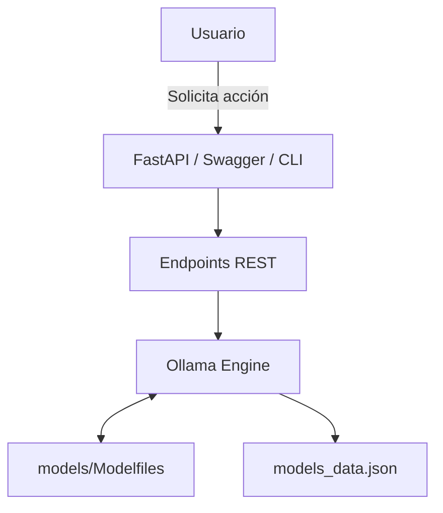

# 🏭 AI Factory# 🏭 AI F[-brightgreen?style=for-the-badge)](./docs/INICIO_RAPIDO.md)

[](./docs/GUIA_FACIL.md)  

**La plataforma definitiva para entrenar, comparar y desplegar modelos de IA locales**[](./docs/SOLUCION_PROBLEMAS.md)

[](./docs/INDICE_DOCUMENTACION.md)ry

[](https://badge.fury.io/py/ai-factory)

[](https://www.python.org/downloads/)> **¡Crea tus propios modelos de IA personalizados en 5 minutos!** 🤖✨  

[](https://opensource.org/licenses/MIT)> Sin conocimientos técnicos complicados - 100% local y gratuito


## 🚀 Instalación Rápida<div align="center">


```bash## 📚 **GUÍAS FÁCILES PARA USUARIOS** 📚

pip install ai-factory

```[-brightgreen?style=for-the-badge)](./INICIO_RAPIDO.md)

[](./GUIA_FACIL.md)  

## ✨ Características Principales[](./SOLUCION_PROBLEMAS.md)

[](./INDICE_DOCUMENTACION.md)

- 🤖 **Entrenamiento de Modelos**: Crea modelos personalizados con tus propios datos

- 📊 **Comparación Inteligente**: Sistema automático de comparación y ranking de versiones**¿Primera vez?** 👆 **¡Usa las guías de arriba!** Son súper fáciles de seguir.

- 🚀 **Despliegue Simplificado**: Deploy con un solo comando 

- 🔧 **CLI Potente**: Interfaz de línea de comandos completa</div>

- 📈 **Métricas Avanzadas**: Análisis de rendimiento y recomendaciones automáticas

- 🌐 **API REST Completa**: 15 endpoints listos para usar---


## 🎯 Inicio RápidoAI Factory es una plataforma completa para crear, entrenar, versionar y desplegar modelos de inteligencia artificial personalizados de forma local. Con threading optimizado, sistema de descargas y una interfaz FastAPI moderna.


### 1. Iniciar el Servidor## 🚀 Características principales


```bash- ✅ **Creación y entrenamiento** de modelos locales con Ollama

# Opción 1: CLI- ⚡ **Threading optimizado** con mejoras de rendimiento 2.91x  

ai-factory start- 📦 **Sistema de deployment** con generación automática de ZIP

- 📥 **Descarga de deployments** directamente desde la API

# Opción 2: Python- 🔄 **Versionado automático** y comparación de modelos

python -m ai_factory.cli start- 📊 **Testing exhaustivo** con suite de pruebas completa

```- 🌐 **Interfaz Swagger** para uso sin código


### 2. Entrenar tu Primer Modelo## 📁 Estructura del proyecto


```bash```

ai-factory train mi-modelo "Eres un asistente útil" --examples examples/chat_data.jsonai-factory/

```├── 📂 api/                    # FastAPI application

│   ├── main.py               # Main FastAPI app

### 3. Usar la API│   ├── router/               # API endpoints

│   └── services/             # Business logic

```python├── 📂 schemas/               # Pydantic schemas

import requests├── 📂 tests/                 # Testing suite

│   ├── unit/                 # Unit tests

# Crear un nuevo modelo│   ├── integration/          # Integration tests

response = requests.post("http://localhost:8000/models", json={│   └── performance/          # Performance tests

    "name": "mi-chatbot",├── 📂 scripts/               # Utility scripts

    "base_model": "llama3.2:1b", │   ├── demo_download_system.py

    "prompt": "Eres un chatbot amigable y útil",│   ├── install.bat/.sh

    "examples": [│   └── generate_modelfile.py

        {"input": "Hola", "output": "¡Hola! ¿Cómo puedo ayudarte hoy?"}├── 📂 docs/                  # Documentation

    ]│   ├── examples/

})│   └── *.md files

├── 📂 utils/                 # Utility functions

print(response.json())├── 📂 data/                  # Model data storage

```├── 📂 deployments/           # Generated deployments

└── 📂 exports/               # Export files

## 🔥 Casos de Uso Reales```


### 💬 Chatbot Personalizado## ⚡ Instalación Súper Fácil


```bash### 🎯 **Instalación Express (Recomendada)**

# Crear chatbot de soporte técnico```bash

curl -X POST http://localhost:8000/models \pip install ai-factory

  -H "Content-Type: application/json" \ai-factory serve

  -d '{```

    "name": "soporte-tech",**¡Listo!** Ve a: `http://localhost:8000/docs`

    "base_model": "llama3.2:1b",

    "prompt": "Eres un experto en soporte técnico. Responde de forma clara y precisa.",### 🛠️ **Prerequisitos**

    "examples": [- **Python 3.8+** (si no tienes: [descargar aquí](https://python.org))

      {"input": "Mi laptop no enciende", "output": "Verificemos paso a paso: 1) ¿Está conectado el cargador? 2) ¿La luz LED está encendida?..."}- **Ollama** para los modelos ([descargar aquí](https://ollama.ai))

    ]

  }'### 📦 **Instalación desde código fuente**

``````bash

# Clonar repositorio

### 📊 Comparar Versiones de Modelosgit clone <repo-url>

cd ai-factory

```bash

# Ver qué versión funciona mejor# Usar script automático

curl http://localhost:8000/models/mi-modelo/compare# Windows: doble clic en scripts/install.bat

# Mac/Linux: ./scripts/install.sh

# Respuesta con ranking automático:

{# O manualmente:

  "model_name": "mi-modelo",pip install -r requirements.txt

  "versions": [python -m uvicorn api.main:app --reload --port 8000

    {```

      "version": "1.0.2",

      "score": 85.5,> **💡 ¿Problemas?** Ve a la [**Guía de Solución de Problemas**](./SOLUCION_PROBLEMAS.md)

      "rank": 1,

      "metrics": {"accuracy": 0.92, "f1_score": 0.88, "avg_response_time": 1.2}## 🚀 Uso rápido

    }

  ],### 1. **Interfaz web (recomendado)**

  "recommendation": {Visita: `http://localhost:8000/docs`

    "best_version": "1.0.2",

    "reason": "Mayor accuracy y mejor tiempo de respuesta",### 2. **API Endpoints principales**

    "confidence": 0.94

  }#### 📝 **Crear modelo**

}```http

```POST /models/create

{

### 🚀 Deploy Inteligente  "model_name": "mi-modelo",

  "base_prompt": "Eres un asistente especializado en...",

```bash  "version": "1.0.0"

# Deploy de la mejor versión automáticamente}

curl -X POST http://localhost:8000/models/mi-modelo/deploy \```

  -H "Content-Type: application/json" \

  -d '{"auto_select_best": true}'#### 🎯 **Entrenar modelo**

```http

# O deploy de versión específicaPOST /models/train

curl -X POST http://localhost:8000/models/mi-modelo/deploy \{

  -H "Content-Type: application/json" \  "model_name": "mi-modelo", 

  -d '{"version": "1.0.2", "port": 8080}'  "prompts": ["Ejemplo 1", "Ejemplo 2"]

```}

```

### 🔄 Crear Nueva Versión con Prompt Mejorado

#### 📦 **Deploy modelo**

```bash```http

# Añadir nueva versión con prompt optimizadoPOST /models/deploy

curl -X POST http://localhost:8000/models/mi-modelo/train \{

  -H "Content-Type: application/json" \  "model_name": "mi-modelo",

  -d '{  "version": "1.0.0"

    "new_prompt": "Eres un asistente experto que siempre incluye ejemplos prácticos en sus respuestas",}

    "examples": [```

      {"input": "¿Cómo usar bucles?", "output": "Los bucles te permiten repetir código. Ejemplo: for i in range(5): print(i)"}

    ]#### 📥 **Descargar deployment**

  }'```http

```# 1. Listar deployments

GET /models/deployments/list

## 📚 Documentación Completa

# 2. Descargar ZIP

| Recurso | Descripción |GET /models/deployments/download/{filename}

|---------|-------------|```

| [📖 Guía Fácil](docs/GUIA_FACIL.md) | Tutorial paso a paso |

| [🔧 CLI Completa](docs/CLI_COMPLETA.md) | Todos los comandos disponibles |## 🧪 Testing

| [🌐 API Completa](docs/API_COMPLETA.md) | Referencia completa de endpoints |

### Ejecutar tests

## 🏗️ Arquitectura```bash

# Tests unitarios

```python -m pytest tests/unit/ -v

AI Factory

├── 🤖 Entrenamiento → Crea modelos personalizados# Tests de integración  

├── 📊 Comparación → Rankea versiones automáticamente  python -m pytest tests/integration/ -v

├── 🚀 Despliegue → Deploy con un comando

└── 📈 Monitoreo → Métricas en tiempo real# Tests de rendimiento

```python -m pytest tests/performance/ -v


## 🛠️ Desarrollo Local# Test completo

python tests/integration/comprehensive_test.py

```bash```

# Clonar repositorio

git clone https://github.com/tu-usuario/ai-factory.git### Scripts de demostración

cd ai-factory```bash

# Demo completo del sistema

# Instalar dependenciaspython scripts/demo_download_system.py

pip install -e .

# Test de deployments

# Ejecutar testspython tests/integration/test_deployment_download.py

pytest tests/```


# Iniciar en modo desarrollo## ⚡ Características avanzadas

ai-factory start --dev

```### **Threading optimizado**

- Procesamiento paralelo con 4 workers

## 🤝 Contribuir- Mejora de rendimiento 2.91x verificada

- Testing automatizado de prompts en paralelo

¡Las contribuciones son bienvenidas! Consulta nuestra [guía de contribución](CONTRIBUTING.md).

### **Sistema de deployments**

## 📄 Licencia- Generación automática de aplicaciones FastAPI standalone

- Archivos ZIP descargables con todo incluido

MIT License - consulta [LICENSE](LICENSE) para más detalles.- Documentación completa y Docker support


## 🆘 Soporte### **Suite de testing**

- Tests unitarios, integración y rendimiento

- 📧 Email: soporte@ai-factory.dev- Validación exhaustiva con 72 tests individuales

- 💬 Discord: [Únete a la comunidad](https://discord.gg/ai-factory)- Reportes detallados de cobertura y métricas

- 🐛 Issues: [GitHub Issues](https://github.com/tu-usuario/ai-factory/issues)

## 📚 Documentación adicional

---

- 📋 **[Tests](tests/README.md)** - Guía completa de testing

**⭐ Si AI Factory te ayuda, ¡dale una estrella en GitHub!**- 🛠️ **[Scripts](scripts/README.md)** - Utilidades y demos
- 📖 **[Docs](docs/)** - Documentación detallada del proyecto

## 🚀 Ejemplo de flujo completo

### **Crear → Entrenar → Deploy → Descargar**
```bash
# 1. Crear modelo
curl -X POST "http://localhost:8000/models/create" \
  -H "Content-Type: application/json" \
  -d '{"model_name": "mi-asistente", "base_prompt": "Eres un asistente especializado", "version": "1.0.0"}'

# 2. Entrenar con ejemplos  
curl -X POST "http://localhost:8000/models/train" \
  -H "Content-Type: application/json" \
  -d '{"model_name": "mi-asistente", "prompts": ["Ejemplo 1", "Ejemplo 2"]}'

# 3. Deploy (genera ZIP automáticamente)
curl -X POST "http://localhost:8000/models/deploy" \
  -H "Content-Type: application/json" \
  -d '{"model_name": "mi-asistente", "version": "1.0.0"}'

# 4. Listar y descargar
curl "http://localhost:8000/models/deployments/list"
curl -o mi-asistente.zip "http://localhost:8000/models/deployments/download/mi-asistente-1.0.0-deployment.zip"
```

## 🔧 Arquitectura técnica

### **Stack tecnológico:**
- **FastAPI** - API REST moderna con Swagger UI
- **Ollama** - Motor local de modelos de IA  
- **Pydantic v2** - Validación robusta de schemas
- **Threading** - Procesamiento paralelo optimizado
- **JSON** - Persistencia simple sin BD externa

### **Flujo interno:**
```
Usuario → FastAPI → Pydantic → Services → Ollama → Response
```

### **Persistencia:**
- `data/models_data.json` - Modelos y metadatos
- `deployments/` - Paquetes generados  
- `exports/` - Exportaciones de usuario

## 🤝 Contribuir

1. Fork el repositorio
2. Crear rama feature: `git checkout -b feature/nueva-funcionalidad`
3. Hacer cambios y tests: `python tests/integration/comprehensive_test.py`
4. Commit: `git commit -am 'Agregar nueva funcionalidad'`
5. Push: `git push origin feature/nueva-funcionalidad`
6. Crear Pull Request

## 📄 Licencia

Este proyecto está bajo licencia MIT. Ver `LICENSE` para más detalles.

---

🏭 **AI Factory** - Plataforma local para IA personalizada | Made with ❤️ for developers
    "prompt": "Clasifica reseñas y detecta sarcasmo",
    "metrics": {"accuracy": 0.94, "f1": 0.90},
    "created_at": "2025-10-07T23:12:00Z",
    "status": "ok"
  }
}
```

---

## 7. Versionado semántico (semver)
- Creación de modelo nuevo → v0.1.0
- Entrenamiento con ejemplos → +0.0.1
- Cambio de prompt → +0.1.0
- Regeneración completa → +1.0.0

---

## 8. CLI
AI Factory se puede ejecutar desde terminal con:

```sh
ai-factory serve --port 8000
```

Esto lanza el servidor FastAPI local en:

    http://localhost:8000/docs

---

## 9. Ventajas clave
- No requiere base de datos.
- 100% local y portable.
- Control completo del versionado.
- Comparación automatizada de métricas.
- Exportación e importación sencilla.
- Ideal para pruebas rápidas y desarrollo de prototipos IA.

---


## 10. Flujo técnico general

<div align="center">



</div>

---

## Animación didáctica (ASCII)

```text
┌────────────┐      POST /models/create      ┌──────────────┐
│   Usuario  │ ───────────────────────────→ │   FastAPI    │
└────────────┘                              └──────────────┘
       │                                           │
       │             Genera Modelfile              │
       │◀──────────────────────────────────────────┘
       │                                           │
       │        Entrena y versiona modelo          │
       │◀──────────────────────────────────────────┐
       │                                           │
       │         Guarda en models_data.json        │
       │◀──────────────────────────────────────────┘
       │                                           │
       │         Exporta/Importa modelos           │
       │◀──────────────────────────────────────────┐
       ▼                                           │
┌────────────┐      DELETE /models/{name}     ┌──────────────┐
│   Usuario  │ ◀───────────────────────────── │   FastAPI    │
└────────────┘                              └──────────────┘
```

---

---

## Estado actual del proyecto

**Etapa:** Desarrollo inicial funcional

- El backend con FastAPI está implementado y permite crear, eliminar, consultar y exportar modelos.
- La persistencia se realiza en `models_data.json`.
- El versionado y la actualización de prompts están soportados.
- Falta la integración real con Ollama y la generación automática de Modelfiles.
- El flujo de entrenamiento y comparación de versiones está esbozado pero no completamente automatizado.
- El sistema es usable localmente y permite pruebas de flujo completo, pero aún no es una solución plug&play para usuarios finales.

---

